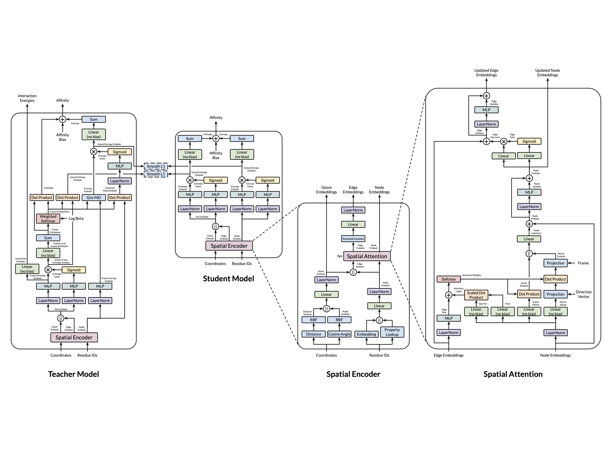
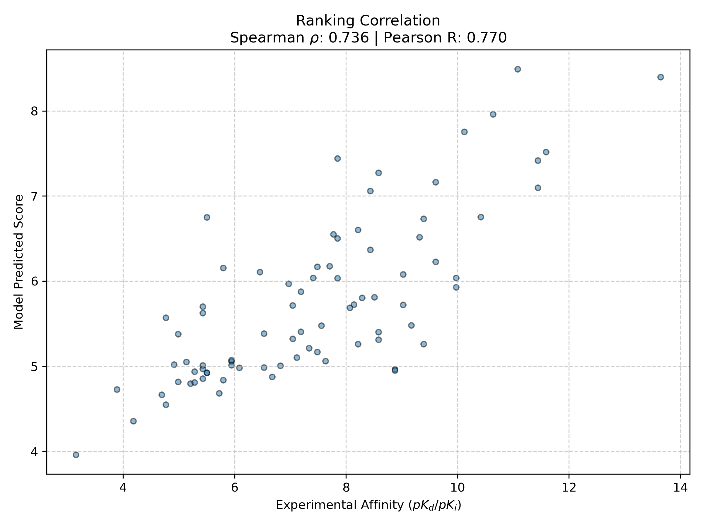

# TrajBind

**Trajectory-Distilled Geometric Graph Neural Network for Protein-Protein Binding Affinity Prediction**

TrajBind is a Geometric GNN that predicts protein-protein binding affinity from a static structure. It uses a teacher-student distillation framework, where a Teacher GNN is trained on 4D MD trajectories to learn thermodynamic representations used to distill a Student GNN to reproduce enthalpic and entropic contributions from a single, static structure at inference time.

---

## Table of Contents

1. [Introduction](#introduction)
2. [Architecture](#architecture)
   - [Architecture Diagram](#architecture-diagram)
   - [Input Representation](#input-representation)
   - [Spatial Encoder](#spatial-encoder)
   - [Spatial Attention](#spatial-attention)
   - [Teacher Model](#teacher-model)
   - [Student Model](#student-model)
3. [Training Scheme](#training-scheme)
   - [Data Preparation](#data-preparation)
   - [Loss Functions](#loss-functions)
   - [Training Phases](#training-phases)
   - [Optimization](#optimization)
   - [Hardware Acceleration](#hardware-acceleration)
4. [Results](#results)
   - [Training Configuration](#training-configuration)
   - [Model Configuration](#model-configuration)
   - [Affinity Benchmark](#affinity-benchmark)

---

## Introduction

Predicting binding affinity is fundamentally a four-dimensional thermodynamic problem, where molecules in aqueous solutions don't have static structures, but instead sample continuous Boltzmann-weighted distributions across a conformational space defined by the potential energy surfaces. Existing approaches either use accurate but extremely slow MD simulations and FEP, or fast but poorly generalizable models and scoring functions that collapse dynamic conformational states into static structures. To address this, **TrajBind** uses a knowledge distillation pipeline where a Teacher model processes full MD trajectories to produce thermodynamic representations, and a Student model is trained to reproduce these from a single structural snapshot.

---

## Architecture

### Architecture Diagram

### Input Representation

Every residue in the complex is represented by four atomic coordinates ordered as `[Cα, C, N, SC]`, with a coordinate tensor of shape `[T, N, 4, 3]`, where the Student uses the same representation with $T=1$. The `Cα, C, N` atoms provide the local backbone frame needed for vector attention, while the `SC` coordinate is the centroid of the non-backbone side-chain atoms, falling back to `Cα` when a residue has no side-chain atoms. The `SC` coordinate provides the distance metric for interface cropping and graph masking, while the PyRosetta supervision targets describe interactions between complete residue pairs. Each residue also carries five physicochemical properties (charge, hydropathy, H-donors, H-acceptors, volume / 100) used to initialize the node embeddings. A binary partner label identifies whether each residue belongs to binding partner A or B, allowing multiple chains belonging to the same partner to be treated as a single body. To supervise the Teacher's enthalpy embedding into learning a physically meaningful latent representation, four PyRosetta pairwise interaction energies (VdW, Elec, Solv, HBond) are also computed pairwise and used as auxiliary supervision targets.

However, due to computational limits, the full set of residues is not used. Instead, residues are filtered according to their minimum side-chain centroid distance to any residue on the opposite binding partner, where residues within 25 Å are kept, and those within 15 Å are marked as core residues. Edges are added between pairs of residues whose side-chain centroids are within 15 Å of each other. To prevent boundary artifacts caused by nodes near the boundary losing neighbors due to the interface cutoff, only the core nodes are used for direct readouts and loss computation, while the non-core nodes only participate in message passing to provide structural context. Similarly, core edges connecting two core nodes are used for edge-centered readouts and losses. To capture the dynamic nature of these structures across time, all replica trajectories are concatenated into a single ~1500-frame sequence per complex. During training, $T$ frames are sampled randomly per epoch, providing broad coverage of the conformational state space without locking the dataset to a fixed set of frames or introducing memory and computational bottlenecks.

---

### Spatial Encoder

Both the Teacher and Student use the same Spatial Encoder architecture, which serves as the core representation-learning module, aggregating residue and geometric information to learn expressive node and edge representations of the molecular complex.

#### Node Embedding Initialization

Node embeddings are initialized from the learnable residue embedding concatenated with the 5 physicochemical properties, then projected:

$$n_i^{(0)} = \text{LayerNorm}(\text{Linear}([x_i \,\|\, y_i]))$$

where $i$ indexes residues, $x_i \in \mathbb{R}^{16}$ is the learned residue-type embedding, $y_i \in \mathbb{R}^{5}$ is its vector of physicochemical properties, and $n_i^{(0)} \in \mathbb{R}^{128}$ is the resulting initial node embedding.

#### Edge Embedding Initialization

Before edge embeddings are initialized, two non-parametric modules compute geometric features from the raw coordinates.

##### Distance Embedding

This module converts raw atomic coordinates into a distance representation by computing the pairwise Euclidean distance matrix across all 4 channels ($C_\alpha, C, N, SC$) between all $N$ residue pairs, producing 16 pairwise distances per residue pair. Each distance is expanded over 16 Gaussian Radial Basis Functions with centers $\mu_c \in [0, 15]$ Å and adjacent-center spacing $\Delta r=1$ Å:

$$d_{ij,kk',c}^{\text{RBF}} = \exp\!\left[-\left(\frac{\|r_{i,k} - r_{j,k'}\| - \mu_c}{\Delta r/\sqrt{4 \ln 2}}\right)^2\right] \qquad k, k' \in \{C_\alpha, C, N, SC\}$$

Here, $r_{i,k} \in \mathbb{R}^3$ is the coordinate of atomic channel $k$ in residue $i$ and $\mu_c$ is the center of RBF channel $c$. The width $\Delta r/\sqrt{4 \ln 2} \approx 0.6006$ Å, equivalent to an exponent coefficient of approximately $2.7726$ Å$^{-2}$, makes adjacent RBFs equal exactly $0.5$ at their midpoint. The $4 \times 4 \times 16$ expanded distances are flattened to form $d_{ij}^{\text{RBF}} \in \mathbb{R}^{256}$ for each residue pair, giving a tensor of shape $[N, N, 256]$. The module also returns the scalar $SC$–$SC$ distance matrix $[N, N]$ used for edge masking.

##### Angle Embedding

Raw distances capture magnitudes but lose orientation. This module encodes the relative orientations of every residue pair using a set of cosine projections. For each residue $i$, a local reference frame is constructed from the three backbone atoms:

$$\vec{f}_{C,i} = \text{norm}(r_{i,C} - r_{i,C_\alpha}) \quad \vec{f}_{N,i} = \text{norm}(r_{i,N} - r_{i,C_\alpha}) \quad \vec{f}_{SC,i} = \text{norm}(r_{i,SC} - r_{i,C_\alpha})$$

$$\vec{f}_{P,i} = \text{norm}(\vec{f}_{C,i} \times \vec{f}_{N,i}) \qquad \mathbf{F}_i = [\vec{f}_{C,i}, \vec{f}_{N,i}, \vec{f}_{P,i}]$$

The unit vectors $\vec{f}_{C,i}$, $\vec{f}_{N,i}$, and $\vec{f}_{SC,i}$ point from $C_\alpha$ toward the corresponding atomic channel, while $\vec{f}_{P,i}$ is the backbone-plane normal. The frame $\mathbf{F}_i \in \mathbb{R}^{3 \times 3}$ is used as the basis and is not orthogonalized because each direction contains a distinct chemical meaning ($C$ direction, $N$ direction, backbone normal).

For each residue pair $(i, j)$, 10 dot products are computed:

$$a_{ij} = \left[\vec{f}_{C,i} \cdot \vec{d}_{ij},\; \vec{f}_{N,i} \cdot \vec{d}_{ij},\; \vec{f}_{SC,i} \cdot \vec{d}_{ij},\; \vec{f}_{C,j} \cdot \vec{d}_{ij},\; \vec{f}_{N,j} \cdot \vec{d}_{ij},\; \vec{f}_{SC,j} \cdot \vec{d}_{ij},\; \vec{f}_{C,i} \cdot \vec{f}_{C,j},\; \vec{f}_{N,i} \cdot \vec{f}_{N,j},\; \vec{f}_{SC,i} \cdot \vec{f}_{SC,j},\; \vec{f}_{P,i} \cdot \vec{f}_{P,j}\right]$$

where $a_{ij} \in \mathbb{R}^{10}$ is the raw orientation feature vector and $\vec{d}_{ij} = (r_{j,C_\alpha} - r_{i,C_\alpha}) / \|r_{j,C_\alpha} - r_{i,C_\alpha}\|$ is the unit direction from residue $i$ to residue $j$. Each of the 10 scalars $a_{ij,m}$ is expanded as $\exp[-((a_{ij,m}-\mu_c)/(\Delta a/\sqrt{ 4\ln 2}))^2]$ over 8 Gaussian RBFs with centers $\mu_c \in [-1, 1]$, where $\Delta a = 2/7$ is the spacing between adjacent centers. The corresponding width is approximately $0.1716$, equivalent to an exponent coefficient of approximately $33.9642$, and makes adjacent RBFs equal exactly $0.5$ at their midpoint. The result is the 80-dimensional angle embedding $a_{ij}^{\text{RBF}} \in \mathbb{R}^{80}$, giving a tensor of shape $[N, N, 80]$.

##### Geometric Feature Fusion

The 256D distance and 80D angle embeddings are concatenated and passed through a linear projection followed by LayerNorm:

$$g_{ij} = \text{LayerNorm}\!\left(\text{Linear}\!\left([d_{ij}^{\text{RBF}} \,\|\, a_{ij}^{\text{RBF}}]\right)\right) \in \mathbb{R}^{128}$$

This geometric representation is then concatenated with the source and destination node embeddings and passed through an MLP (384→256→128) with SiLU activation, allowing the initial edge representation to learn nonlinear interactions between pair geometry and the identities of both residues. A final LayerNorm normalizes the resulting edge embedding before message passing:

$$e_{ij}^{(0)} = \text{LayerNorm}\!\left(\text{MLP}\!\left([g_{ij} \,\|\, n_i^{(0)} \,\|\, n_j^{(0)}]\right)\right)$$

Here, $g_{ij}$ is the projected geometric representation of residue pair $(i,j)$ and $e_{ij}^{(0)} \in \mathbb{R}^{128}$ is its initial directed edge embedding.

#### Attention Layers

After initialization, $L$ Spatial Attention layers iteratively refine both node and edge embeddings. Due to computational and memory constraints, this model uses $L=2$ layers.

#### Edge Symmetrization

After all attention layers, edge embeddings are made order-invariant by combining three symmetric pairwise features and projecting them back to the hidden dimension:

$$e_{ij} = \text{LayerNorm}\!\left(\text{Linear}\!\left([e_{ij}^{(L)} + e_{ji}^{(L)} \;\|\; e_{ij}^{(L)} \odot e_{ji}^{(L)} \;\|\; |e_{ij}^{(L)} - e_{ji}^{(L)}|]\right)\right)$$

Here, $e_{ij}^{(L)}$ and $e_{ji}^{(L)}$ are the final refined edge embeddings in opposite directions and $\odot$ denotes element-wise multiplication. Each term is unchanged under the index swap $(i \leftrightarrow j)$, so the resulting edge representation is symmetric with respect to residue order.

---

### Spatial Attention

This is the core message-passing layer. At layer $\ell$, it computes geometry-biased multi-head attention from $n^{(\ell)}$ and $e^{(\ell)}$, then uses the resulting attention weights to aggregate both scalar values and direction-aware vector messages.

#### Query, Key, Scalar, and Vector Projections

All four bias-free projections are applied to a pre-normalized copy of the node embedding (Pre-LayerNorm) and divided across $H$ attention heads:

$$q_{i,h}^{(\ell)} = \left[W_q \cdot \text{LayerNorm}(n_i^{(\ell)})\right]_h \quad k_{i,h}^{(\ell)} = \left[W_k \cdot \text{LayerNorm}(n_i^{(\ell)})\right]_h$$

$$u_{i,h}^{(\ell)} = \left[W_u \cdot \text{LayerNorm}(n_i^{(\ell)})\right]_h \quad v_{i,h}^{(\ell)} = \left[W_v \cdot \text{LayerNorm}(n_i^{(\ell)})\right]_h$$

Here, $q$, $k$, $u$, and $v$ are the query, key, scalar-value, and vector-value projections, respectively, where $i$ indexes residues and $h$ indexes attention heads. With hidden dimension $D=128$ and $H=8$ heads, each projection has $C=D/H=16$ channels per head, so $q_{i,h}^{(\ell)}, k_{i,h}^{(\ell)}, u_{i,h}^{(\ell)}, v_{i,h}^{(\ell)} \in \mathbb{R}^{C}$.

#### Attention Weights with Edge Bias

Attention scores are computed as dot-product attention augmented by a geometry-aware edge bias. The edge-bias MLP takes edge embeddings $e_{ij}^{(\ell)}$ and outputs one scalar $b_{ij,h}^{(\ell)}$ per head, injecting geometric context directly into the attention logits:

$$A_{ij,h}^{(\ell)} = \frac{q_{i,h}^{(\ell)} \cdot k_{j,h}^{(\ell)}}{\sqrt{C}} + b_{ij,h}^{(\ell)} \qquad b_{ij,h}^{(\ell)} = \left[\text{MLP}_{\text{bias}}(e_{ij}^{(\ell)})\right]_h$$

Let $m_{ij}$ denote whether edge $(i,j)$ is enabled by the Spatial Encoder's validity and distance mask. The masked logits and attention weights are:

$$\widetilde{A}_{ij,h}^{(\ell)} =
\begin{cases}
A_{ij,h}^{(\ell)}, & m_{ij}=1 \\
-10^9, & m_{ij}=0
\end{cases}
\qquad
w_{ij,h}^{(\ell)} = \text{Dropout}\!\left(\text{Softmax}_j(\widetilde{A}_{ij,h}^{(\ell)})\right)$$

Dropout is applied after softmax during training to prevent the network from hyper-fixating on a single dominant connection.

#### Scalar Aggregation

The scalar branch computes an attention-weighted sum of the scalar values:

$$\tilde{u}_{i,h,c}^{(\ell)} = \sum_j w_{ij,h}^{(\ell)} u_{j,h,c}^{(\ell)} \qquad \tilde{u}_i^{(\ell)} = \text{Flatten}_{h,c}(\tilde{u}_{i,h,c}^{(\ell)}) \in \mathbb{R}^{D}$$

Here, $c$ indexes the $C$ channels within each head. This branch captures information that does not depend on the directions of the neighbors.

#### Vector Aggregation

The vector branch captures information that depends on the direction of the neighbors. Each scalar component $v_{j,h,c}^{(\ell)}$ of the vector-value projection $v_{j,h}^{(\ell)}$ scales the unit direction $\vec{d}_{ij}$ from residue $i$ to residue $j$, and the resulting 3D messages are aggregated using the same attention weights:

$$\vec{v}_{i,h,c}^{(\ell)} = \sum_j w_{ij,h}^{(\ell)} v_{j,h,c}^{(\ell)} \vec{d}_{ij} \in \mathbb{R}^3$$

Each aggregated vector is then projected onto the receiving node's local reference frame $\mathbf{F}_i$:

$$\tilde{v}_{i,h,c}^{(\ell)} = \mathbf{F}_i^\top \vec{v}_{i,h,c}^{(\ell)} = \begin{bmatrix} \vec{f}_{C,i} \cdot \vec{v}_{i,h,c}^{(\ell)} \\ \vec{f}_{N,i} \cdot \vec{v}_{i,h,c}^{(\ell)} \\ \vec{f}_{P,i} \cdot \vec{v}_{i,h,c}^{(\ell)} \end{bmatrix} \in \mathbb{R}^3 \qquad \tilde{v}_i^{(\ell)} = \text{Flatten}_{h,c}(\tilde{v}_{i,h,c}^{(\ell)}) \in \mathbb{R}^{3D}$$

Under a global rotation, both $\vec{v}_{i,h,c}^{(\ell)}$ and $\mathbf{F}_i$ rotate together, leaving $\tilde{v}_{i,h,c}^{(\ell)}$ unchanged. Under a reflection, however, the plane normal $\vec{f}_{P,i} = \text{norm}(\vec{f}_{C,i} \times \vec{f}_{N,i})$ changes parity, allowing the representation to retain chiral information.

The vector representation $\tilde{v}_i^{(\ell)}$ is concatenated with the scalar representation $\tilde{u}_i^{(\ell)}$ for the node update:

$$[\tilde{u}_i^{(\ell)} \,\|\, \tilde{v}_i^{(\ell)}] \in \mathbb{R}^{4D} = \mathbb{R}^{512}$$

#### Node Update

Within each attention layer, node update occurs in two residual stages. First, the concatenated scalar and vector representations are injected into the node embedding through a zero-initialized linear output projection (512→128):

$$\tilde{n}_i^{(\ell)} \leftarrow n_i^{(\ell)} + \text{Linear}([\tilde{u}_i^{(\ell)} \,\|\, \tilde{v}_i^{(\ell)}])$$

The injected node embedding is then updated by a pre-normalized residual MLP following the $D \to 2D \to D$ expansion pattern, which uses a zero-initialized final layer:

$$n_i^{(\ell+1)} \leftarrow \tilde{n}_i^{(\ell)} + \text{MLP}(\text{LayerNorm}(\tilde{n}_i^{(\ell)}))$$

#### Edge Update

After the node update, information from the refined node embeddings is injected back into the edge embeddings using a multiplicative Hadamard gate. Node $i$ injects information while node $j$ acts as a gate:

$$\tilde{e}_{ij}^{(\ell)} \leftarrow e_{ij}^{(\ell)} + \text{Linear}(n_i^{(\ell+1)}) \odot \sigma(\text{Linear}(n_j^{(\ell+1)}))$$
$$e_{ij}^{(\ell+1)} \leftarrow \tilde{e}_{ij}^{(\ell)} + \text{MLP}(\text{LayerNorm}(\tilde{e}_{ij}^{(\ell)}))$$

Here, one linear layer projects the updated source node $i$, while a separate linear layer produces an element-wise gate from destination node $j$ ($\odot$ denotes element-wise multiplication). The gating mechanism allows the network to selectively route information from updated node states into the pairwise edge representation. Both linear projections and the MLP's final layer are zero-initialized.

---

### Teacher Model

The Teacher operates on a window of $T$ Molecular Dynamics frames, with $T=16$ used during final Teacher training and target generation. Each frame is processed independently by the shared Spatial Encoder before any temporal aggregation, so the model treats the trajectory as an unordered conformational ensemble rather than a chronological sequence. In this section, $n_i^{(t)}$, $e_{ij}^{(t)}$, and $g_{ij}^{(t)}$ denote the final node, symmetric edge, and geometric embeddings returned for frame $t$ after the $L$ Spatial Attention layers. The Teacher learns an enthalpic contribution to affinity from each frame and an entropic contribution across the conformational ensemble, then exports gated latent representations for Student distillation.

#### Frame Enthalpies

For each residue pair $(i,j)$ in frame $t$, the final edge embedding is concatenated with the direct geometric embedding to form $[e_{ij}^{(t)} \,\|\, g_{ij}^{(t)}] \in \mathbb{R}^{2D}$. An MLP uses this representation to learn nonlinear interactions between the refined structural context and direct geometry, while a separate gating MLP learns how strongly each pair should contribute:

$$h_{ij}^{(t)} = \text{MLP}\!\left(\text{LayerNorm}([e_{ij}^{(t)} \,\|\, g_{ij}^{(t)}])\right) \in \mathbb{R}^D \qquad \gamma_{ij}^{H,(t)} = \sigma\!\left(\text{MLP}\!\left(\text{LayerNorm}([e_{ij}^{(t)} \,\|\, g_{ij}^{(t)}])\right)\right) \in (0,1)$$

Here, $h_{ij}^{(t)}$ is the ungated local enthalpy embedding and $\gamma_{ij}^{H,(t)}$ is its scalar contribution gate. The embedding MLP follows a $2D \to 4D \to D$ expansion, while the gate uses a $2D \to D/2 \to 1$ bottleneck with a zero-initialized final layer. Applying the gate gives the gated local enthalpy embedding:

$$\tilde{h}_{ij}^{(t)} = \gamma_{ij}^{H,(t)} h_{ij}^{(t)}$$

A shared bias-free linear head $W_H \in \mathbb{R}^{1 \times D}$ converts the local embeddings to scalar contributions. Because the head is bias-free, gating the embedding is equivalent to gating its scalar value:

$$H_{ij}^{(t)} = W_H \cdot h_{ij}^{(t)} \qquad \tilde{H}_{ij}^{(t)} = W_H \cdot \tilde{h}_{ij}^{(t)} = \gamma_{ij}^{H,(t)} H_{ij}^{(t)} \qquad H^{(t)} = \sum_{ij \in \text{interface}} \tilde{H}_{ij}^{(t)}$$

The interface contains residue pairs whose two nodes are core nodes, whose side-chain centroids are within 15 Å, and whose binary partner labels differ. This selects interactions between the two binding partners rather than between individual chains.

For physical auxiliary supervision, a separate bias-free head $W_I \in \mathbb{R}^{4 \times D}$ projects the ungated enthalpy embedding into the four PyRosetta interaction channels [VdW, Elec, Solv, HBond]:

$$I_{ij}^{(t)} = W_I \cdot h_{ij}^{(t)} \in \mathbb{R}^4$$

This head is used during both energy pretraining and subsequent Teacher training. Its loss is evaluated on core residue pairs within 15 Å, independently of whether the residues belong to the same or opposite binding partners.

#### Boltzmann Temporal Pooling

Because $H^{(t)}$ serves as the model's energy-like enthalpic score for conformation $t$, it is used to construct a Boltzmann-style distribution over the sampled frames. This gives more favorable conformations greater influence on the ensemble prediction, while the softmax normalizes their weights:

$$p^{(t)} = \text{Softmax}_t\!\left(\beta H^{(t)}\right) \qquad \beta = e^{\log\beta} > 0$$

where $\log\beta$ is the learned parameter, and exponentiation ensures that the inverse-temperature parameter $\beta$ remains positive. In this model, $H^{(t)}$ is the enthalpic contribution to affinity rather than physical energy, where larger values represent more favorable, stable conformations. The positive sign therefore assigns greater probability to more stable frames, corresponding to the usual negative sign being absorbed into the definition of $H^{(t)}$. The normalized pooling is invariant to any permutation of the frame order.

The frame contributions are Boltzmann-pooled into the overall enthalpic contribution:

$$H = \sum_t p^{(t)} H^{(t)} \in \mathbb{R}$$

#### GMD Conformational Dispersion

The Teacher represents the conformational contribution at the node level by measuring how each residue's learned local environment varies across the ensemble. It uses the Gini mean difference as a non-parametric $L_1$ dispersion statistic, so large deviations contribute linearly rather than quadratically, and no Gaussian form is assumed for the latent distribution.

The raw node embeddings are first projected into an entropy-specific latent space:

$$s_i^{(t)} = \text{MLP}\!\left(\text{LayerNorm}(n_i^{(t)})\right) \in \mathbb{R}^D$$

where the MLP follows a $D \to 2D \to D$ expansion. Each $s_i^{(t)}$ is derived from one complete frame, and the frames are never averaged before their differences are computed.

For each node $i$, the Boltzmann-weighted expected pairwise absolute difference across all $T \times T$ frame pairs is then computed:

$$s_i = \sum_{t} \sum_{t'} p^{(t)} p^{(t')} \left|s_i^{(t)} - s_i^{(t')}\right| \in \mathbb{R}^D$$

Each component $d$ of $s_i$ encodes the Boltzmann-weighted expected pairwise difference of one learned conformational feature.

Note that if a residue has an identical latent representation across all $T$ sampled frames, then $s_i^{(t)} = s_i^*$ for all $t$, so

$$\left|s_i^* - s_i^*\right| = 0 \implies s_i \equiv 0 \implies S_i \equiv 0$$

A gate conditioned on the Boltzmann-weighted node embedding controls the structural relevance of the dispersion embedding:

$$n_i = \sum_t p^{(t)} n_i^{(t)} \qquad \gamma_i^S = \sigma\!\left(\text{MLP}\!\left(\text{LayerNorm}(n_i)\right)\right) \qquad \tilde{s}_i = \gamma_i^S s_i$$

A bias-free linear head $W_s \in \mathbb{R}^{1 \times D}$ projects the local entropy embeddings to scalar contributions. As in the enthalpy branch, the gated local value can equivalently be obtained by gating the ungated value:

$$S_i = W_s \cdot s_i \qquad \tilde{S}_i = W_s \cdot \tilde{s}_i = \gamma_i^S S_i \qquad S = \sum_{i \in \text{core}} \tilde{S}_i$$

Here, $s_i$ is a learned measure of conformational dispersion rather than a direct estimate of physical entropy, and $W_s$ maps it to the local entropic affinity contribution $S_i$. The gate is conditioned on $n_i$, which encodes the residue's geometry, chemistry, and local environment, rather than on $s_i$ itself. This separates the decision of whether a residue is structurally relevant from the magnitude of its conformational dispersion, while the sum over core nodes excludes buffer-zone residues from the global readout.

#### Affinity Prediction

The overall enthalpic and entropic contributions are combined with a learned scalar bias $b_{\text{aff}}$ to produce the final affinity prediction:

$$G = H + S + b_{\text{aff}}$$

Larger values of either contribution increase the predicted affinity $G$ and indicate greater stability. Only their sum is supervised directly by the experimental affinity target, so the enthalpy–entropy decomposition is an architectural inductive bias rather than a uniquely identified physical separation.

#### Target Export for Distillation

Once trained, the Teacher is frozen and run over the dataset to generate the gated latent targets:

$$\tilde{h}_{ij}^{\text{target}} = \sum_t p^{(t)} \tilde{h}_{ij}^{(t)} \in \mathbb{R}^D \qquad \tilde{s}_i^{\text{target}} = \tilde{s}_i \in \mathbb{R}^D$$

For enthalpy, pre-multiplication preserves the temporal covariance between the pair gate and latent embedding because $\mathbb{E}[\gamma^H h] = \mathbb{E}[\gamma^H]\mathbb{E}[h] + \text{Cov}_p(\gamma^H,h)$. Distilling the two marginal expectations separately would discard this covariance term. For entropy, the gated product gives the Student the exact latent representation consumed by the shared linear readout.

---

### Student Model

The Student operates on a single static frame ($T=1$) and uses the same Spatial Encoder architecture as the Teacher with separate learned parameters. Without access to a temporal ensemble, it cannot construct the Teacher's Boltzmann distribution or compute GMD directly. Instead, it learns to predict the Teacher's final gated local enthalpy and entropy embeddings from one structure:

$$\tilde{h}_{ij} \approx \tilde{h}_{ij}^{\text{target}} \qquad \tilde{s}_i \approx \tilde{s}_i^{\text{target}}$$

The Student does not reproduce the Teacher's individual frames or its ungated embeddings and gates separately; it predicts the gated representations consumed by the Teacher-calibrated scalar readouts.

#### Coordinate Noise (Training Only)

During training, independent Gaussian noise with $\sigma=0.015$ Å is added to each coordinate channel:

$$r'_{i,k} = r_{i,k} + \vec{\epsilon}_{i,k} \qquad \vec{\epsilon}_{i,k} \sim \mathcal{N}(\mathbf{0}, \sigma^2 \mathbf{I}_3)$$

This acts as coordinate-level data augmentation, encouraging the Student to remain stable under small geometric perturbations. Noise is not applied during inference.

#### Enthalpy Prediction

The final edge embedding and direct geometric embedding are concatenated as in the Teacher to form $[e_{ij} \,\|\, g_{ij}] \in \mathbb{R}^{2D}$. Separate MLPs use this representation to predict an ungated local enthalpy embedding and its scalar gate, using the same layer dimensions as the corresponding Teacher modules but separate parameters:

$$h_{ij} = \text{MLP}\!\left(\text{LayerNorm}([e_{ij} \,\|\, g_{ij}])\right) \in \mathbb{R}^D \qquad \gamma_{ij}^H = \sigma\!\left(\text{MLP}\!\left(\text{LayerNorm}([e_{ij} \,\|\, g_{ij}])\right)\right) \in (0,1)$$

Their product forms the predicted gated enthalpy embedding used for distillation:

$$\tilde{h}_{ij} = \gamma_{ij}^H h_{ij} \qquad \tilde{h}_{ij} \approx \tilde{h}_{ij}^{\text{target}}$$

The bias-free enthalpy head $W_H \in \mathbb{R}^{1 \times D}$ converts the local embeddings to scalar contributions, which are summed over interface pairs:

$$H_{ij} = W_H \cdot h_{ij} \qquad \tilde{H}_{ij} = W_H \cdot \tilde{h}_{ij} = \gamma_{ij}^H H_{ij} \qquad H = \sum_{ij \in \text{interface}} \tilde{H}_{ij}$$

Because distillation constrains the gated product directly, $h_{ij}$ and $\gamma_{ij}^H$ do not need to reproduce the Teacher's Boltzmann-pooled ungated embedding and gate separately.

#### Entropy Prediction

The Student cannot compute pairwise temporal dispersion from one frame. It therefore maps the final node embedding directly to a local entropy embedding and gate whose product approximates the Teacher's GMD-derived target:

$$s_i = \text{MLP}\!\left(\text{LayerNorm}(n_i)\right) \in \mathbb{R}^D \qquad \gamma_i^S = \sigma\!\left(\text{MLP}\!\left(\text{LayerNorm}(n_i)\right)\right) \in (0,1)$$

$$\tilde{s}_i = \gamma_i^S s_i \qquad \tilde{s}_i \approx \tilde{s}_i^{\text{target}}$$

The entropy MLP follows the same $D \to 2D \to D$ expansion as the Teacher, while the gate follows the same $D \to D/2 \to 1$ bottleneck; both use separate Student parameters. The bias-free entropy head $W_s \in \mathbb{R}^{1 \times D}$ converts the predicted embeddings to local scalar contributions, which are summed over core nodes:

$$S_i = W_s \cdot s_i \qquad \tilde{S}_i = W_s \cdot \tilde{s}_i = \gamma_i^S S_i \qquad S = \sum_{i \in \text{core}} \tilde{S}_i$$

During distillation, $W_H$, $W_s$, and $b_{\text{aff}}$ are copied from the trained Teacher and frozen. The Student's Spatial Encoder, embedding MLPs, and gates remain separate trainable modules, so the fixed readouts require its predicted embeddings to carry the same scalar meaning as the Teacher targets.

#### Affinity Prediction

The Student combines its predicted enthalpic and entropic contributions with the scalar affinity bias to produce its final affinity prediction:

$$G = H + S + b_{\text{aff}}$$

---

## Training Scheme

### Data Preparation

| Dataset | Processed Entries | Role |
|---|---|---|
| DynaRepo matched to PDBbind | 562 | Teacher training and Student distillation |
| PDBbind protein–protein set | 1,370 | Student affinity fine-tuning |
| Kastritis / PRODIGY benchmark | 81 | Static-structure evaluation |

#### Trajectory Data

DynaRepo trajectories were matched to experimental affinities and binding-partner annotations from PDBbind. Simulation chains were assigned to the reference partners by sequence matching, with ambiguous assignments resolved by selecting the closest interface and requiring an interpartner atomic contact within 5 Å. Replica trajectories were concatenated for each entry. Of 565 indexed entries, 562 were successfully processed. For each frame, PyRosetta provided four residue-pair interaction targets: van der Waals attraction plus repulsion, electrostatics, solvation, and the sum of hydrogen-bond terms. Targets were computed for core–core pairs within 20 Å, though interaction supervision uses a tighter 15 Å mask.

#### Static Structures and Benchmark Filtering

The PDBbind protein–protein set was filtered against all 81 Kastritis / PRODIGY benchmark complexes before fine-tuning. A candidate complex was excluded if any of its protein chains shared at least 35% sequence identity with any benchmark chain. Identity was measured by global alignment with BLOSUM62, using gap-opening and extension penalties of 11 and 1, and normalized by the shorter sequence length. This removed 1,426 of 2,798 candidates, leaving 1,372. Two further complexes lacked a binding partner after structural processing, resulting in 1,370 usable structures. All 81 benchmark complexes were processed successfully.

### Loss Functions

Training combines supervision on pairwise interaction energies, experimental affinity, and the Teacher's gated latent representations. All Huber losses use a threshold of 1.

#### Interaction Loss

The Teacher predicts four PyRosetta interaction channels VdW, Elec, Solv, and HBond from its ungated enthalpy embeddings. Positive targets above 10 are logarithmically compressed to limit the influence of steric clashes. Predictions and compressed targets are then divided by per-channel standard deviations computed across the entire dataset using the same selection as the active loss. Huber loss is evaluated on core–core residue pairs within 15 Å, including pairs on the same binding partner. For each channel, targets with an absolute compressed value above 0.01 are considered active while the rest are inactive. The two groups are averaged separately across all complexes and frames in the batch, then combined with weights of 1 for active entries and 0.01 for inactive entries. The four channel losses are summed to produce the final loss value.

#### Affinity Loss

The affinity loss combines Huber regression against experimental affinity with a pairwise ranking term, weighted by 0.1 and 1, respectively. Regression is averaged over complexes in the batch. Ranking compares every unordered pair of complexes in the batch, where predicted and experimental affinity differences are passed through a sigmoid and compared using binary cross-entropy, averaged over the pairs. This encourages agreement in both ordering and relative separation. 

#### Distillation Loss

The Student matches the Teacher's fixed, gated enthalpy and entropy embeddings using elementwise Huber loss. Enthalpy supervision includes core–core pairs on opposite binding partners within 15 Å of each other in the Student input, including coordinate noise during training. Entropy supervision includes all core residues.

### Training Phases

Training follows a five-stage Teacher–Student pipeline.

#### Phase 1: Energy Pretraining (Teacher, $T=1$)

The Teacher learns to predict the four PyRosetta interaction energies from single frames. This trains the Spatial Encoder, enthalpy embedding MLP, and interaction head to capture molecular geometry and local interaction physics before introducing ensemble aggregation.

**Loss:** $\mathcal{L}_{\text{interaction}}$

#### Phase 2: Thermodynamic Training (Teacher, $T=4$)

The pretrained Teacher learns to predict experimental affinity from four sampled frames per complex while retaining interaction supervision. All Teacher parameters are trainable, allowing the gates, temporal weights, and enthalpic and entropic readouts to adapt jointly.

**Loss:** $\mathcal{L}_{\text{interaction}} + \mathcal{L}_{\text{affinity}}$

#### Phase 3: Thermodynamic Fine-Tuning (Teacher, $T=16$)

The Teacher continues training on larger ensembles of 16 sampled frames. This increases conformational coverage and is intended to reduce sampling variability in the GMD entropy representation before target generation.

**Loss:** $\mathcal{L}_{\text{interaction}} + \mathcal{L}_{\text{affinity}}$

#### Phase 4: Distillation (Student, $T=1$)

The trained Teacher is frozen and evaluated on one sampled 16-frame ensemble per complex to generate the gated targets $\tilde{h}_{ij}^{\text{target}} \in \mathbb{R}^{D}$ and $\tilde{s}_i^{\text{target}} \in \mathbb{R}^{D}$. Dropout is disabled, and these targets remain fixed throughout Student training.

A new Student learns to predict the fixed Teacher targets and experimental affinity from individual frames, with Gaussian coordinate noise applied during training. Its Spatial Encoder, embedding MLPs, and gates are initialized independently. The scalar readouts $W_H$, $W_s$, and affinity bias $b_{\text{aff}}$ are copied from the Teacher and frozen, preserving the mapping from latent embeddings to affinity contributions.

**Loss:** $\mathcal{L}_{\text{distillation}} + \mathcal{L}_{\text{affinity}}$

#### Phase 5: Student Affinity Fine-Tuning ($T=1$)

The distilled Student is fine-tuned on static structures such as PDBBind using experimental affinity alone. All Student parameters, including the previously frozen readouts and affinity bias, are trainable during this stage.

**Loss:** $\mathcal{L}_{\text{affinity}}$

### Optimization

Training uses AdamW with separate learning rates for the scalar readout heads, gate MLPs and learned temperature values, and remaining representation layers. Learning rates increase linearly during warmup, then halve when the total validation loss plateaus beyond the chosen patience. A reproducible split reserves 10% of complexes for validation by default, where training resamples frames on each pass, and validation uses fixed frame samples with dropout and coordinate noise disabled.

### Hardware Acceleration

TrajBind was developed on a MacBook Pro with an Apple M5 Max (18-core CPU, 40-core GPU, 64 GB unified memory), using PyTorch MPS with float32 precision. The model uses dense representations to take advantage of efficient matrix operations and avoid the high overhead of sparse indexing on the MPS backend. Each batch is padded to a multiple of 32 residues to limit the number of unique tensor shapes and prevent the MPS JIT compiler from repeatedly compiling and caching new kernels, which otherwise causes cache bloat. Gradient checkpointing is also used to reduce training memory.

---

## Results

### Training Configuration

The final Student uses 2 epochs of affinity fine-tuning after 85 epochs of distillation. Its Teacher was trained for 46 epochs of energy pretraining, 130 epochs of thermodynamic training, and 56 epochs of thermodynamic fine-tuning. These counts describe the selected checkpoints in the training scheme based on the validation loss, rather than the full duration of each run.

| Phase | Readout LR | Gate LR | Representation LR | Weight Decay | Warmup Epochs | Patience | Epochs Trained |
|---|---|---|---|---|---|---|---|
| 1: Energy Pretraining | $10^{-3}$ | — | $10^{-3}$ | $10^{-4}$ | 2 | 10 | 46 |
| 2: Thermodynamic Training | $10^{-3}$ | $10^{-3}$ | $10^{-3}$ | $10^{-3}$ | 5 | 10 | 130 |
| 3: Thermodynamic Fine-Tuning | $10^{-3}$ | $10^{-4}$ | $10^{-4}$ | $10^{-3}$ | 2 | 10 | 56 |
| 4: Distillation | — | $5\times10^{-4}$ | $10^{-4}$ | $10^{-3}$ | 2 | 10 | 85 |
| 5: Student Affinity Fine-Tuning | $5\times10^{-4}$ | $2\times10^{-4}$ | $10^{-5}$ | $10^{-3}$ | 2 | 10 | 2 |

### Model Configuration

#### Spatial Encoder

| Hyperparameter | Value |
|---|---:|
| Hidden dimension | 128 |
| Residue embedding dimension | 16 |
| RBFs per distance feature | 16 |
| RBFs per angle feature | 8 |
| Spatial Attention layers | 2 |
| Attention heads | 8 |

#### Teacher and Student Models

| Model | Total Parameters |
|---|---:|
| Teacher | 1,147,780 |
| Student | 1,147,267 |

### Affinity Benchmark

The final Student was evaluated on the 81-complex Kastritis / PRODIGY benchmark.

| Metric | Value |
|---|---:|
| RMSE | $2.201$ |
| MAE | $1.791$ |
| Pearson correlation | $0.770$ |
| Pearson p-value | $4.52 \times 10^{-17}$ |
| Spearman correlation | $0.736$ |
| Spearman p-value | $4.85 \times 10^{-15}$ |

